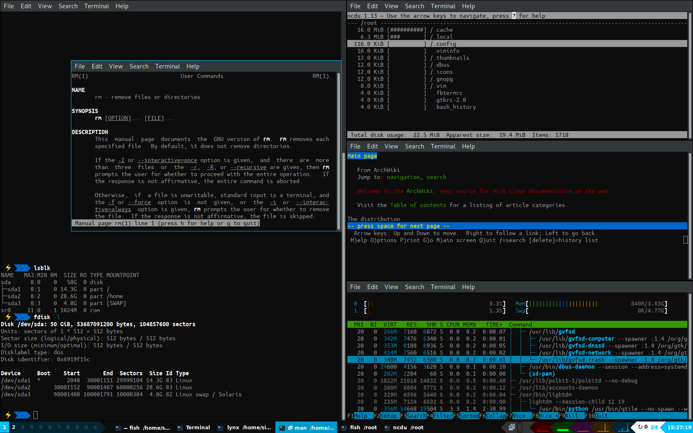

# About this config
This config uses:
+ Ubuntu fonts, powerline-patched:
+ debian-based: install *fonts-powerline*

# Screenshots
## Desktop without programs
  
## Demo windows
  

# Keybindings
MACS | Key            | Action                                 | Status
:----|:---------------|:---------------------------------------|:-------
M=CS | F4             | system: shutdown                       | ✓
M=CS | F5             | system: reboot                         | ✓
M=C= | F5             | qtile: restart                         | ✓
M=C= | F4             | qtile: quit                            | ✓
M=C= | Left, Right    | workspace: move to prev/next workspace | ✓
M=C= | 1-0            | workspace: goto workspace              | ✓
M=CS | 1-0            | workspace: move window to workspace    | ✓
=A== | Tab            | layout: cycle windows                  | ✓
=A=S | Tab            | layout: cycle windows (reverse)        | ⚠
M=== | *arrows*       | layout: focus windows                  | ✓
M==S | *arrows*       | layout: move window                    | ✓
M==S | KP_Insert      | layout: rotate windows                 | ⚠  
M=== | +, -           | layout: Resize window                  | ✓
M=== | Return         | layout: maximize/minimize window       | ✓
M==S | Return         | layout: normalize window               | ⚠
M=== | Tab            | layout: cycle layout                   | ✓
M==S | Tab            | layout: cycle layout (reverse)         | ⚠
M=== | F11            | window: toggle fullscreen              | ✓
M==S | F11            | window: toggle floating                | ✓
M=== | F4             | window: quit                           | 👴
=A== | F4             | window: quit                           | ✓
M=== | 1-0            | launch: custom hotkeys 1               | ✓
M==S | 1-0            | launch: custom hotkeys 2               | ✓
M=== | t              | launch: GUI terminal emulator          | ✓
==CS | Escape         | launch: htop                           | ✓
M=== | f              | launch: GUI file manager               | ✓
M==S | f              | launch: GUI file manager (sudo)        | ✓
M=C= | f              | launch: text file manager              | ✓
M=CS | f              | launch: text file manager (sudo)       | ✓
==== | XF86WWW        | launch: GUI WWW browser                | ?
===S | XF86WWW        | launch: GUI WWW browser 2              | ?
==C= | XF86WWW        | launch: text WWW browser               | ?
M=== | W              | launch: GUI WWW browser                | ✓
M==S | W              | launch: GUI WWW browser 2              | ✓
M=C= | W              | launch: text WWW browser               | ✓
M=== | e              | prompt: text editor                    | ✓
M==S | e              | prompt: text editor (sudo)             | ✓
MA== | e              | prompt: GUI editor                     | ✓
MA=S | e              | prompt: GUI editor (sudo)              | ✓
M=== | r              | prompt: run                            | ✓
M==S | r              | prompt: run (sudo)                     | ✓

# Graphs
1. CPU
1. RAM
1. SWAP
1. HDD
1. NET
